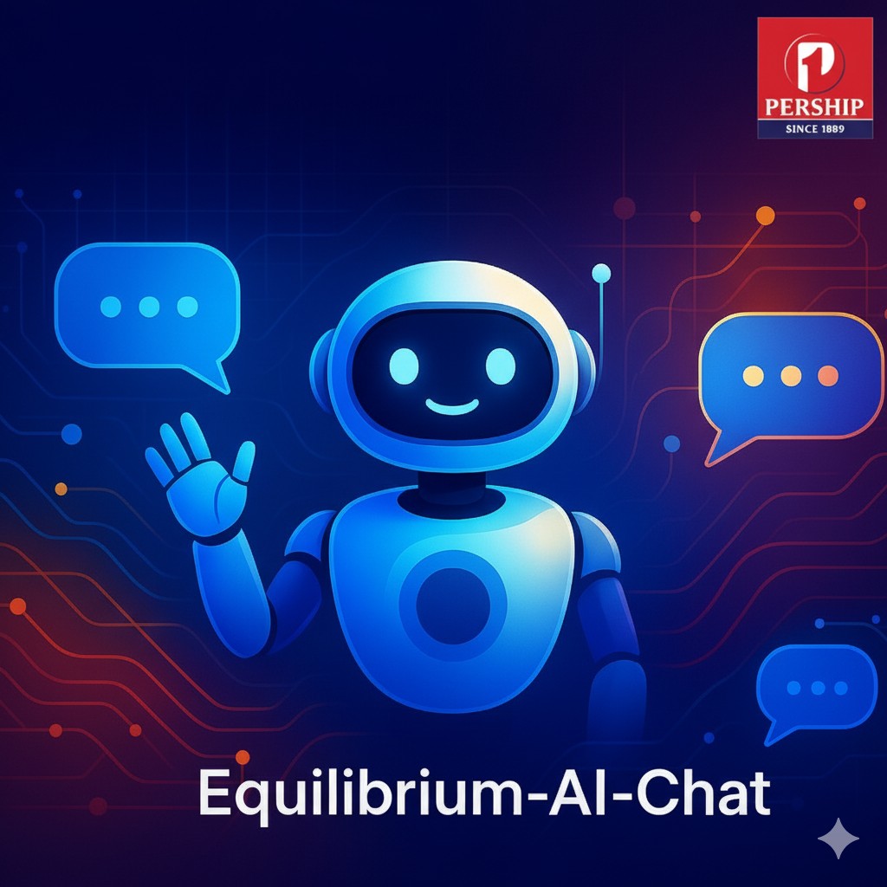
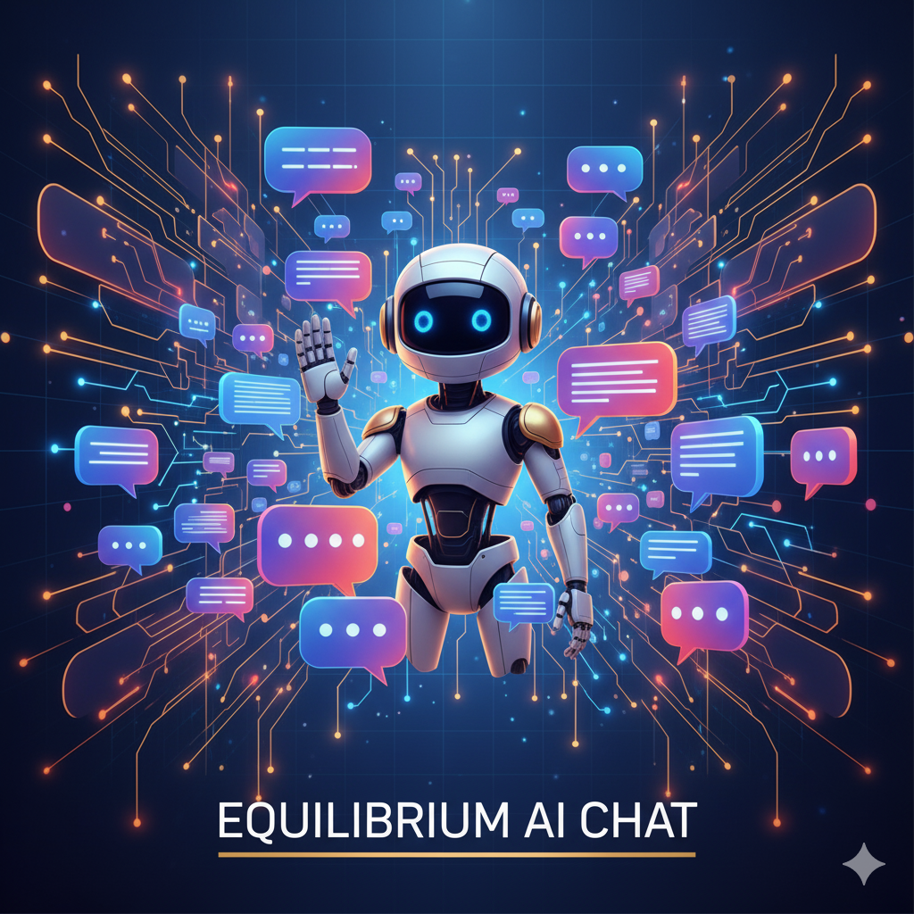

# Equilibrium-AI-Chat

<div align="center">
    
</div>

<div align="justify">
An intelligent, coordinated multi-agent chat system developed for Pership Group. It seamlessly combines Retrieval-Augmented Generation (RAG) with local/cloud LLMs and interactive data visualization to serve as a versatile enterprise information assistant and decision support platform.
</div>

---

## 🏗️ Core Architecture & Agent Workflow

The system follows a coordinated **Multi-Agent Architecture** optimized for precision and performance:

```
                  ┌──────────────────────┐
                  │      User Query      │ (API / Web UI)
                  └──────────┬───────────┘
                             │
                             ▼
                  ┌──────────────────────┐
                  │    Manager Agent     │ (Manager_Agent_01.py)
                  └──────────┬───────────┘
                             │
                             ├────────────────────────┐
                  [Route: RAG_Agent]            [Route: None]
                             │                        │
                             ▼                        ▼
                  ┌──────────────────────┐   ┌───────────────────────┐
                  │      RAG Agent       │   │    Direct LLM         │
                  │   (RAG_Agent.py)     │   │ (General Knowledge &  │
                  └──────────┬───────────┘   │   Web Search Fallback)│
                             │               └──────────┬────────────┘
                             ▼                          │
                     [FAISS Retrieval]                  │
                             │                          │
                             └───────────┬──────────────┘
                                         │
                                         ▼
                             ┌──────────────────────┐
                             │    FastAPI / JSON    │
                             │       Response       │
                             └──────────────────────┘
```

### 1. Manager Agent (`Manager_Agent_01.py`)

- **The Coordinator:** Analyzes incoming user queries (either text or transcribed voice) and decides whether to delegate to a specialized worker or handle the response directly.
- **Routing Strategy:**
  - **`RAG_Agent`**: Selected when the query asks about internal company guidelines, employee dress codes, finance SOPs, or standard policies.
  - **`None`**: Selected for general knowledge questions, external searches, or conversational greetings. The query is then answered directly by the LLM (using its built-in knowledge base and search capabilities).

### 2. RAG Agent (`RAG_Agent.py` & `Vector_DB_Create.py`)

- **Internal Knowledge Base:** Deals with internal corporate documents, HR policies, and standard operating procedures.
- **FAISS Vector DB:** Leverages a local FAISS index for high-performance semantic retrieval of relevant document chunks, ensuring the response is grounded and context-aware.

---

## 🚀 Key Features & Capabilities

### 1. Document Intelligence (RAG)

- **On-the-Fly Processing:** Seamlessly upload corporate PDFs through the API endpoints. The system chunkifies, generates embeddings, and updates the FAISS vector database in real-time.
- **Traceable Citations:** Every response generated by the RAG Agent lists its document sources and includes an automated document summary to verify accuracy.

### 2. General Knowledge & Web Search Fallback

- **Direct Query Resolution:** Handled immediately by the Manager Agent utilizing the advanced `llama-3.1-8b-instant` or selected models on Groq, ensuring fast and context-rich answers.

### 3. Voice AI & Speech Synthesis

- **Transcribe on the Fly:** Click to speak into your microphone; the system uses `whisper-large-v3` to transcribe the audio in real-time.
- **Realistic Speech Synthesis:** Converts the generated answer into high-quality audio using `canopylabs/orpheus-v1-english` so the assistant talks back.

### 4. Interactive Data Dashboards (`Data_DashBoard/`)

- **Analytical Presentation:** Dedicated data visualization modules to present and process dataset statistics.
- **Interactive Components:** Custom UI components for quick visual analytics.

---

## 💼 Business Value

1. **Information Accessibility:** Quick, centralized access to internal policies, reducing manual lookups for HR, IT, and Finance teams.
2. **Decision Support:** Fast, data-driven insights through clear visual representation and high-accuracy text generation.
3. **Operational Efficiency:** Automated voice transcription, real-time query routing, and automated document summaries save significant overhead time.
4. **Quality Assurance:** Built-in fact-checking, detailed document source citation, and semantic routing prevent hallucinations.

---

## 📂 Project Structure

```
.
├── config.json                    # Configuration and API keys
├── main.py                        # FastAPI endpoints wrapping the agent logic
├── Equilibrium_Ai.py              # Legacy Streamlit application entry point
├── Manager_Agent_01.py            # Query routing and management
├── RAG_Agent.py                   # Document processing and retrieval
├── Vector_DB_Create.py            # Vector database management (FAISS)
│
├── Data_DashBoard/                # Data visualization components
│   ├── Dash_*.py                  # Dashboard implementations
│   └── Data_for_dashboard/        # Dashboard data sources
│
├── FAISS_Index/                   # Vector database files
│   ├── index.faiss
│   ├── index.pkl
│   └── processed_files.json       # Keeps track of indexed documents
│
├── uploaded_docs/                 # Internal PDF documents storage
├── Voice_ai_log/                  # Stores temporary voice and speech recordings
└── requirements.txt               # Project dependencies
```

---

## 🛠️ Setup & Installation

### 1. Install Dependencies

Clone the repository and install the required dependencies:

```bash
pip install -r requirements.txt
```

### 2. Configure API Keys

Create or update `config.json` in the root directory:

```json
{
  "GROQ_API_KEY": "your_groq_api_key_here"
}
```

_Note: Make sure your `GROQ_API_KEY` is loaded. It is required for both the Manager routing and RAG generations._

### 3. Run the Backend API

Start the FastAPI backend application using Uvicorn:

```bash
.venv\Scripts\python.exe -m uvicorn main:app --reload --port 8000
```

_(This starts the backend on port 8000, waiting for connections from the Next.js frontend.)_

---

## 🎯 Usage & Example Queries

Once the backend and frontend are running, you can interact with the API or Web UI:

1. **Internal Policy Queries (Routed to `RAG_Agent`):**
   - _"What is the dress code policy for employees?"_
   - _"Explain the mobile phone allowance policy guidelines."_
2. **General Knowledge & Conversational Queries (Routed directly):**
   - _"What's the current market salary trend for ML Engineers?"_
   - _"Hello! How can you help me today?"_

---

## 🚀 Ideas for Improvement & Next Steps

### 1. Enhance the RAG Capabilities

- **Advanced Chunking Strategy:** Implement semantic chunking or hierarchical chunking to improve retrieval precision.
- **Hybrid Search & Reranking:** Add BM25 keyword search alongside vector search, followed by a reranker model (e.g., Cohere) to dramatically boost retrieval relevance.
- **Distributed Vector DB:** Scale to managed vector databases (such as Pinecone, Qdrant, or Weaviate) as the enterprise document corpus grows.

### 2. Upgrade Multi-Agent Routing

- **Conversational Memory:** Introduce conversational history buffers to the Manager Agent so multi-turn follow-up interactions feel completely natural.
- **Agent Fallbacks:** Implement custom error correction logic in case the LLM routing JSON parse fails or is interrupted.

### 3. Frontend & API Decoupling

- **FastAPI Backend:** Wrap the core agent orchestration in a RESTful API layer using **FastAPI** to decouple client and server.
- **Unified Web UI:** Build a fully responsive custom React/Next.js frontend for an even more polished user experience.

### 4. Codebase Maintenance & DevOps

- **Dockerization:** Create a `Dockerfile` and `docker-compose.yml` to package the FastAPI app, FAISS index, and dependency environments into isolated containers.
- **Clean Code:** Standardize code format and completely deprecate any unused legacy files or legacy packages.

---

## 🤝 Contributing

1. Fork the repository.
2. Create your feature branch (`git checkout -b feature/AmazingFeature`).
3. Commit your changes (`git commit -m 'Add some AmazingFeature'`).
4. Push to the branch (`git push origin feature/AmazingFeature`).
5. Open a Pull Request.

---

## 📄 License

This project is proprietary and confidential. © 2025 Pership Group. All rights reserved.

---

## 📞 Contact

**Pership Group**

- **Website:** [www.pershipgroup.com](https://www.pershipgroup.com)

<div align="center">
    
</div>
